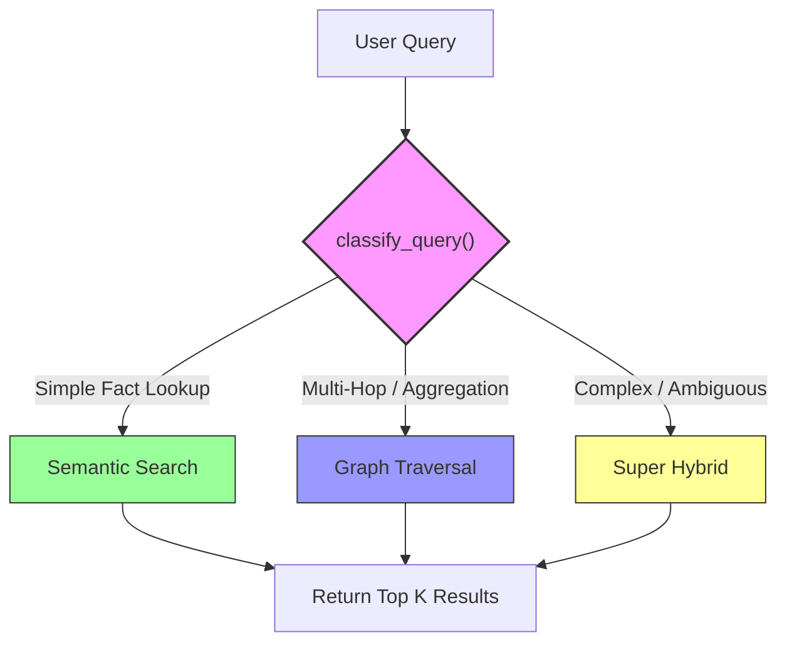

# Adaptive Retrieval Strategy

## Flow Diagram

## Classification Prompt

The LLM is given this constrained prompt to classify each query:

> **Strategies:**
> 1. `semantic` - Fact lookups, definitions, error codes. *High precision.*
> 2. `graph` - Multi-hop reasoning, implicit dependencies, aggregation. *Bridges keyword gaps.*
> 3. `super_hybrid` - Complex, "Why" questions, or uncertain. *Safe default.*
>
> **Output ONLY the strategy name.**

## Code Location

| Component | File | Function |
| :--- | :--- | :--- |
| Classifier | `main.py` | `classify_query(query)` |
| Dispatcher | `main.py` | `retrieve_context_docs(strategy="adaptive")` |

## Benchmark Results

| Strategy | Integral | MRR | nDCG@5 |
| :--- | :---: | :---: | :---: |
| **Adaptive** | **0.624** | **0.872** | **0.640** |
| Semantic | 0.622 | 0.872 | 0.635 |
| Super Hybrid | 0.607 | 0.833 | 0.611 |
