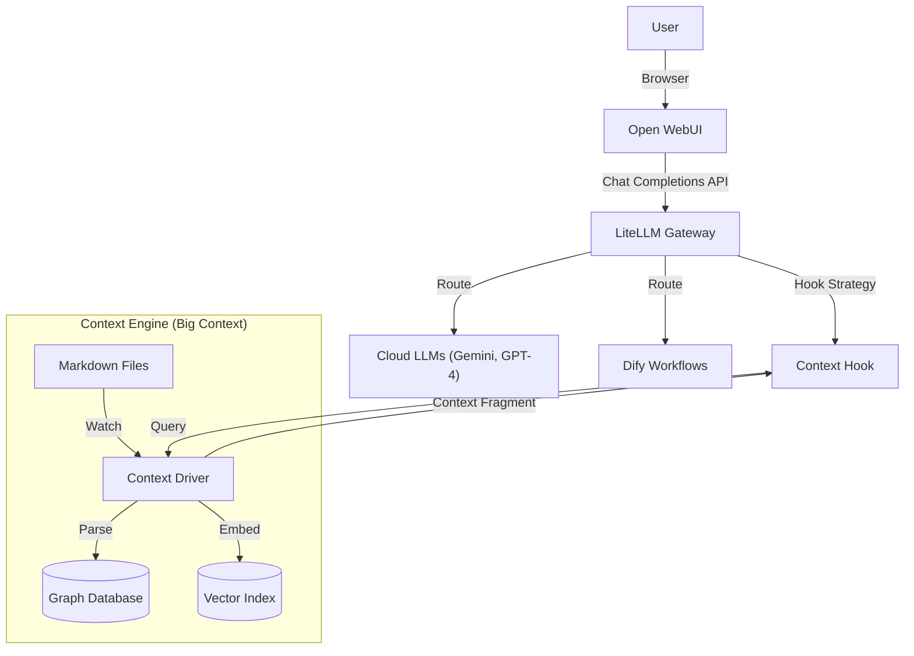

# LLM Box Architecture

## 1. System Overview

**LLM Box** is a personal, high-context Large Language Model (LLM) workstation designed to provide a unified chat interface with advanced, personalized context retrieval capabilities ("Big Context"). It integrates best-in-class open-source tools to create a local-first, privacy-respecting, and highly customizable AI environment.

### Core Value Proposition
- **Unified Interface**: Single glass pane for all LLM interactions.
- **Model Agnostic**: Seamless switching between local (Ollama, vLLM) and hosted (OpenAI, Anthropic, Gemini) models.
- **Big Context**: Dynamic injection of personal knowledge base data (notes, docs) based on semantic and graph relationships.
- **Workflow Automation**: Complex multi-step reasoning and task execution.

## 2. High-Level Architecture

The system is composed of four primary layers:

1. **Presentation Layer** (UI)
2. **Gateway & Interception Layer** (Model Access)
3. **Intelligence & Workflow Layer** (Execution)
4. **Context Layer** (Data & Storage)

## 3. Component Details

### 3.1. User Interface: Open WebUI

**Role**: The primary interaction point.

- **Responsibility**: Chat history, user management, prompt templates, RAG integration (client-side), and model selection.
- **Configuration**: Pointed solely to the LiteLLM Gateway, treating it as an OpenAI-compatible endpoint.

### 3.2. Model Gateway: LiteLLM

**Role**: The central router and control point.

- **Responsibility**:
  - API normalization (OpenAI format).
  - Authentication and Budgeting.
  - **Hook Integration**: Crucial for "Big Context". Custom hooks intercept the prompt before it goes to the upstream model to inject context.

### 3.3. Intelligence: Dify & LLMs

**Role**: The brains of the operation.

- **External LLMs**: Direct access to SOTA models.
- **Dify**: An "LLM App" builder. LiteLLM can route specific model names (e.g., `model: workflow-research`) to a Dify API endpoint, effectively triggering an agent or workflow instead of a raw completion.

### 3.4. Context Driver: The "Big Context"

**Role**: Manages the Source of Truth (SoT) and retrieval.

#### 3.4.1. Source of Truth (SoT)

- **Format**: Plain text files (Markdown) in a designated directory.
- **Structure**: Obsidian-style capabilities (Wikilinks `[[Link]]`, Frontmatter YAML).

#### 3.4.2. Ingestion Pipeline

- **File Watcher**: Detects changes in real-time.
- **Parser**: Extracts structure (headers, links) and content.
- **Indexer**: Updates the Graph and Vector indices.

#### 3.4.3. Data Structures

- **Graph Index**: Represents the explicit relationships between notes.
  - *Nodes*: Files, Sections.
  - *Edges*: Links, Parent/Child relationships.
  - *Purpose*: Navigation-based retrieval (e.g., "Give me the context of the linked project").
- **Vector Index**: Represents semantic meaning.
  - *Purpose*: Similarity-based retrieval (e.g., "Find notes related to 'architecture'").

## 4. Workflows

### 4.1. Chat with Context

1. User sends message: "How does the caching works in our app?"
2. **Open WebUI** sends request to **LiteLLM**.
3. **LiteLLM Hook** pauses the request.
4. Hook sends query "caching works app" to **Context Driver**.
5. **Context Driver** performs hybrid search:
   - **Vector**: Finds `cache-strategy.md` and `redis-config.md`.
   - **Graph**: Finds `app-architecture.md` (linked by `cache-strategy`).
6. **Context Driver** returns a consolidated context block.
7. **LiteLLM** prepends context to the system prompt.
8. Request forwarded to **LLM**.
9. Response flows back to User.

## 5. Technology Stack Proposals

- **Language**: Rust or Python (for Context Driver).
- **Core Libraries**:
  - *LiteLLM* (Python).
  - *FastEmbed* or *SentenceTransformers* (Embeddings).
  - *Qdrant* or *Chroma* (Vector Store).
  - *Petgraph* (Rust) or *NetworkX* (Python) (Graph).
