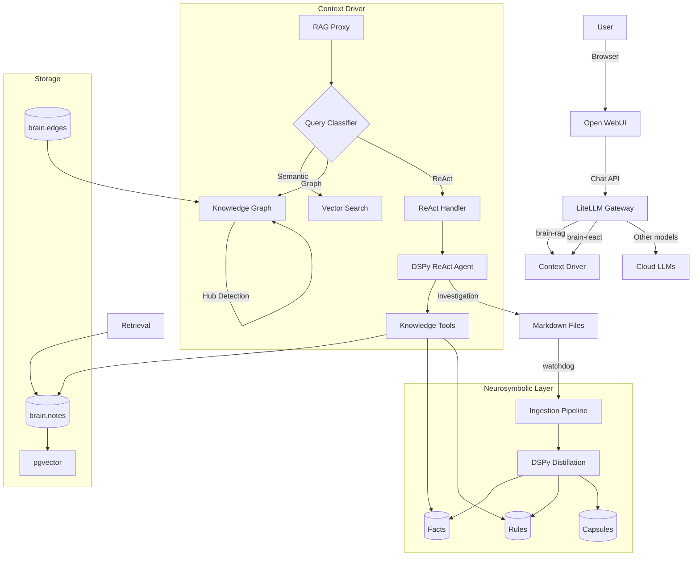

# Context Engine Architecture

## 1. System Overview

**Context Engine** is a neurosymbolic knowledge system that transforms raw documents into executable domain knowledge. It provides a unified chat interface with advanced retrieval, structured knowledge extraction, and agentic reasoning capabilities.

### Core Value Proposition

- **Neurosymbolic Knowledge**: Extracts Facts (S-P-O triples), Rules (IF-THEN logic), and Capsules (summaries) from documents
- **Multi-Mode Retrieval**: Semantic, keyword, hybrid, and graph-based search
- **Agentic Reasoning**: ReAct agents that think, act, and verify answers
- **Adaptive RAG**: Automatically classifies queries to choose the best strategy (Semantic vs Graph vs Hybrid)
- **Pseudo-Models**: `brain-rag` (fast retrieval) and `brain-react` (verified reasoning)

## 2. High-Level Architecture



## 3. Component Details

### 3.1. User Interface: Open WebUI

**Role**: Primary interaction point for users.

- Chat history and conversation management
- Model selection (including `brain-rag` and `brain-react`)
- Treats LiteLLM as an OpenAI-compatible endpoint

### 3.2. Model Gateway: LiteLLM

**Role**: Central router and pseudo-model registration.

**Configured Models:**
```yaml
model_list:
  - model_name: brain-rag       # Single-pass RAG
  - model_name: brain-react     # Multi-step reasoning
  - model_name: gpt-4o-mini     # Direct OpenAI
  - model_name: claude-3-haiku  # Direct Anthropic
```

Routes `brain-*` models to Context Driver at `http://context-driver:8000/v1`.

### 3.3. Context Driver

**Role**: The intelligence layer — RAG proxy, ReAct orchestration, and ingestion.

**Key Endpoints:**
| Endpoint | Purpose |
|----------|---------|
| `POST /v1/chat/completions` | OpenAI-compatible chat (RAG or ReAct) |
| `POST /v1/context` | Preview retrieved context |
| `GET /tools/search` | Hybrid search API |
| `GET /tools/facts` | Query extracted facts |
| `GET /tools/rules` | Query extracted rules |

### 3.4. Adaptive Context Retrieval

The system now employs **Adaptive RAG** to optimize retrieval based on query intent:

**1. Query Classification:**
Incoming queries are classified into strategies:
- **Semantic**: Simple fact lookups (e.g., "What is error 500?")
- **Graph**: Multi-hop reasoning or relationship queries (e.g., "Who manages the project that uses logical replication?")
- **Super Hybrid**: Complex queries requiring both exact facts and structural context.

**2. Graph-Hybrid Search 2.0:**
When "Graph" or "Super Hybrid" is selected, the system performs a sophisticated traversal:
- **Wide Semantic Sweep**: Finds top 15 candidate chunks.
- **Hub Detection (PageRank-lite)**: Identifies "Hub" documents that are heavily referenced by the candidates, even if they don't semantically match the query (e.g., a central "Glossary" or "Architecture Overview").
- **Query-Aware Edge Filtering**: Uses an LLM to extract relevant relationship types from the query (e.g., "managed_by", "uses") to prefer relevant edges during traversal.

### 3.4. Pseudo-Models

#### brain-rag
Single-pass retrieval-augmented generation:
1. Receive query
2. Hybrid search (semantic + BM25 + RRF)
3. Inject context into system prompt
4. Forward to real LLM
5. Return with source citations

#### brain-react
Multi-step verified reasoning:
1. Receive query
2. Initialize DSPy ReAct agent
3. Agent iteratively: **Think → Act → Observe**
4. Verify draft answer against knowledge base
5. Estimate confidence (0.0–1.0)
6. Save successful investigations as artifacts
7. Return answer with reasoning trace

### 3.5. DSPy ReAct Agent

**File:** `react_agent.py`

```python
class KnowledgeBaseReActAgent(dspy.Module):
    def __init__(self, max_iters=7):
        self.react = dspy.ReAct(
            signature=AnswerQuestion,
            tools=KNOWLEDGE_BASE_TOOLS,
            max_iters=max_iters
        )
        self.verifier = KnowledgeBaseVerifier()
```

**Available Tools:**
- `search_knowledge_base(query)` — Hybrid search
- `get_facts(subject, predicate)` — Query S-P-O triples
- `get_rules(domain, severity)` — Query IF-THEN rules
- `get_capsule(title)` — Document summary
- `get_document_section(title, section)` — Extract section
- `get_related_documents(title)` — Graph navigation
- `list_documents(domain, intent)` — Browse knowledge base

### 3.6. Neurosymbolic Primitives

Extracted during ingestion via DSPy signatures:

| Primitive | Schema | Purpose |
|-----------|--------|---------|
| **Capsule** | summary, key_points, intent, domain | High-level doc understanding |
| **Fact** | subject, predicate, object, confidence | Entity relationships |
| **Rule** | condition, action, severity | Executable constraints |

### 3.7. Storage Layer

**PostgreSQL with pgvector:**

| Table | Contents |
|-------|----------|
| `brain.notes` | Documents with embeddings |
| `brain.chunks` | Document chunks for fine-grained retrieval |
| `brain.facts` | S-P-O triples |
| `brain.rules` | IF-THEN rules |
| `brain.capsules` | Document summaries |
| `brain.edges` | Knowledge graph links |

## 4. Workflows

### 4.1. Chat with RAG (brain-rag)

```
User: "How do I renew SSL certificates?"
  ↓
LiteLLM routes to Context Driver (brain-rag)
  ↓
Hybrid search finds: SSL_Certificates.md, HTTPS_Setup.md
  ↓
Context injected into system prompt
  ↓
Forward to gpt-4o-mini
  ↓
Response: "To renew SSL certificates... [Source 1: SSL_Certificates.md]"
```

### 4.2. Chat with ReAct Reasoning (brain-react)

```
User: "What happens if the database connection fails?"
  ↓
LiteLLM routes to Context Driver (brain-react)
  ↓
DSPy ReAct Agent initialized
  ↓
Thought: "I need to find failure handling rules for databases"
Action: get_rules(domain="database", severity="critical")
Observation: "RULE_DB_001: IF connection fails THEN page DBA"
  ↓
Thought: "Found the rule. Let me verify with search"
Action: search_knowledge_base("database connection failure")
Observation: "Found: Database_Operations.md..."
  ↓
Draft answer synthesized
  ↓
Verification: Correct ✓
Confidence: 0.92
  ↓
Investigation artifact saved
  ↓
Response includes reasoning trace
```

## 5. Technology Stack

| Component | Technology |
|-----------|------------|
| **UI** | Open WebUI |
| **Gateway** | LiteLLM |
| **Context Driver** | Python, FastAPI |
| **Database** | PostgreSQL 16 + pgvector |
| **Embeddings** | OpenAI text-embedding-3-large |
| **Agent Framework** | DSPy |
| **File Watching** | watchdog |
| **Containerization** | Docker Compose |

## 6. Directory Structure

```
context-engine/
├── docker-compose.yml      # Service orchestration
├── Makefile                # Developer commands
├── config/
│   └── litellm/config.yaml # Model routing
├── context_driver/
│   └── src/
│       ├── main.py         # FastAPI app, RAG proxy
│       ├── db.py           # Database + ingestion
│       ├── react_agent.py  # DSPy ReAct agent
│       └── dspy_tools.py   # Knowledge base tools
└── volumes/
    ├── raw/                # Source markdown files
    ├── postgres/           # Database storage
    └── redis/              # Cache storage
```
